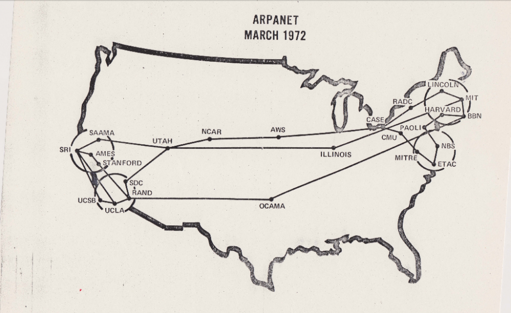

# PORTFOLIO WEBSITE
_The following content is required as part of rubric for Coder Academy Diploma Accreditation_

Website: www.josht.dev  
[GitHub Repository](https://github.com/JoshTeperman/Portfolio-Site)

This website is the developer portfolio for Josh Teperman. The intended audience for this website includes: potential employers, recruiters, and the developer community as a means of sharing ideas and open source code. It is also intended to be a core piece of my public face on the internet. 

----

## Sitemap:

FILE STRUCTURE:

Readme.md  
/DOCS (files linked by Readme)  
/SRC (Website)  
/PPT (Powerpoint Presentation)  

WEBSITE SITEMAP:  

/Root index.html (Home)  
/SRC about.html  
/SRC projects.html  
/SRC contact.html  
/SRC night-index.html  
/SRC night-about.html  
/SRC night-projects.html  
/SRC night-contact.html  
/SRC /STYLES index.css   
/SRC /STYLES home.css   
/SRC /STYLES about.css   
/SRC /STYLES projects.css   
/SRC /STYLES contact.css   
/SRC /STYLES letters.css   
/SRC /STYLES nav.css   
/SRC /STYLES contact-buttons.css   
/SRC /STYLES tiles.css   
/SRC /STYLES night-index.css   
/SRC /STYLES /NIGHT night-index.css   
/SRC /STYLES /NIGHT home.css   
/SRC /STYLES /NIGHT about.css   
/SRC /STYLES /NIGHT projects.css   
/SRC /STYLES /NIGHT contact.css   
/SRC /STYLES /NIGHT letters.css   
/SRC /STYLES /NIGHT nav.css   
/SRC /STYLES /NIGHT contact-buttons.css   
/SRC /STYLES /NIGHT tiles.css   

----

### Website Content & Features

  * Responsive to three screen sizes (Desktop, Tablet, Mobile)
  * Professional Photo
  * Welcome page with links to CV and Blog 
  * Description of recent work history in Australia and Overseas
  * List of projects & links to GitHub repositories
  * Variety of contact options
  * Two different colour schemes (normal and night mode)

### Tech Stack

- HTML
- CSS

### Screenshots
  
)  
)  
)  

----

## DOCUMENTATION

### DESIGN PROCESS   DAY 1-2

To design my site I drew on several resources for inspiration, including  
1. Reviewing portfolio websites of other designers and developers 
  - [Example 1](https://www.mockplus.com/blog/post/web-developer-portfolio)  
  - [Example 2](https://codeburst.io/10-awesome-web-developer-portfolios-d266b32e6154)  
  - [Example 3](https://emmawedekind.com)  
  - [Example 4](https://philna.sh/)  
2. Browsing and saving ideas from Dribbble.com
  - https://dribbble.com/joshteperman/buckets/1131269-portfolio-site-colour-scheme-ideas

I then saved all of my ideas into a mood board on Figma, and documented colour palettes:

[Figma Link - See here for full document](https://www.figma.com/file/I5aZ8kwm7nnAs7RhYkU3LJye/Portfolio-Site?node-id=0%3A1)  

COLOUR PALETTES:
  
[Figma Screenshot 3](screenshot)  

After that I designed more than 10 different ideas for my own website theme, using tone-based wireframes to determine the value-relationships I would like to have between different elements on my page. I quickly decided that I would aim for a minimal, modern look, using lots of white space and over-size header text. The idea was to avoid over-design and focus on the code itself, while still finishing with a professional-looking product.  

BRAINSTORMING HOME PAGE VALUES:
  

I then combined the wireframe deseign of my homepage with the colour palettes of my moodboard:
   

For text, I went for a unified look, with Roboto. I did three types of testing:
1) Header Text: Against different background values, using different levels of text opacity, and a variety of colour palettes. 
2) Paragraph Text: Against light, medium and dark values, using three colours for the text itself
3) Accessibility Testing: Using contrast-ratio.com and colorsafe.co for colour / text combinations

To ensure the page wouldn't end up looking too boring, I went for white background and a bright, high-saturation colour palette to maximise contrast. I was inspired to use this limited warm palette based on reds, oranges, and yellows. Later in the project I decided to expand the palette with green and blue to add further contrast, but used very sparingly.  

FINAL DESIGN:

  

### PROJECT EXECUTION / CODING PROCESS   DAY 3-5

### Version Control and Task Management:
Throughout the project, I used a Trello Board as a to do list, and also as a place to store ideas for new features. I used Git and GitHub for source control.

Trello Day 2:
  
Trello Last Day:
  
GITHUB COMMITS:
  

### Considerations: Usability
Since I was using a limited, high-contrast colour palette on white background, it was important to me to make sure that the page was easy to read / not painful on the eyes. Throughout the project I asked classmates and family to review the site and give feedback.  
FAMILY FEEDBACK:

The overall feedback was generally positive, and helped me make a few adjustments that improved overall readability. For instance, I decreased the opacity of the headers to make the letters more visible, and rearranged the colour combinations so that the same colours wouldn not overlap. This issue is particularly apparent in the below example, which shows two yellow letters overlapping which is difficult to read, and then the final version:

  
  

Over concerns the text would still be difficult to read for some viewers, I added a second colour scheme 'Night Mode', which uses light text on dark background.  

NIGHT MODE:

### Considerations: Ethical
Considering the nature of this projects, there were no serious ethical considerations. It was important to me that the project be accessible to anyone, so I was careful with language, I credited designers work where appropriate, and published the project as open source to encourage community development.

### Code Structure / Design Decisions
I attempted to create code with minimum repetition, maximum readability and that was easy to debug and edit through the following considerations.
- All pages use the same composition
  * Large-size main header font set top left for Desktop, and Centered for Mobile and Tablet
  * Margin all around the page (but not visible), and Navbar set in the same position (top right for Desktop), bottom center for Mobile and Tablet
- All html code follows exactly same structure. 
  * Containter Wrapper inside Body tag
  * Navbar
  * Content div
  * Header, unbroken on Desktop, and wrapped / centered on Mobile & Tablet to fit on the page.
  * Some kind of content, (images, text, buttons, or tiles)
- The elements of each page are named to be readable and intuitive. The Headers are named by their actual text, when the header word is split in two for mobile & tablet, each piece is named with 'abridged1' and 'abridged2' respectively. All Header letters are given the parent class 'letters' etc etc. This made it very easy to code each page and debug, as everything followed the same format, and all I had to do was change specifi content and make minor adjustments. 
- I decided to create separate style CSS documents for each individual page, yet each repeated element has a single style document. This resulted in a structure where the CSS for each page is coded individually with the purpose of arranging the contents of that page (composition) and had to be coded separately, however common details like the style for header letters, the navbar, links, project tiles etc are coded once and then shared / accessible accross all pages. 
- Because my design was so simple and only required centering / ordering elements, I used flexbox instead of tables or grid. This made it simple to structure each individual element, and also allows for maximal responsiveness at different screen sizes. 
- Using a limited colour palette made it easy to design elements. Every page has a white background, all important links / highlighted elements are coloured with red, and all text is dark-gray. This ensures what I want to stand out actually stands out. Due to this restraint, the few elements that break this colour scheme (single green letter in the Header, blue links to highight CV etc) draw the eye and break up the page, and are easy to control.

----

### Key Challenge: Coding the Headings
The most difficult part of the project was creating the headers. I created this page with the intention of adding Javascript responsiveness for _each letter_ at a later date. To do this, I couldn't wrap the the text in a single h1 tag, each letter had to be separate. After some experimentation, I decided to wrap each letter in it's own individual span tag and make it an inline block so they would sit next to each other. This also allowed me to rotate individual elements, push them up / down / left / right to stylize the headings individually. This wouldn't have been possible otherwise, but was much more challenging.  

To execute the colour scheme, I was able to access indvidual letters by using a structure of child / parent classes for the heading that gave me different altitudes of specification. 
- I could acess the entire header using the name of the header itself eg: ".joshteperman {}" ".projects {}"
- For smaller screen sizes which necessitated 2 line headers, I split the header into two and created classes for each that allow me to access a single line. eg: .joshteperman becomes ".firstname {}" and ".lastname {}" for the first and second line. 
- To go to the lowest altitude of access, I could target letters in three ways:
  * all letters with the "span" tag, or with .letters class
  * all letters of a particular name / page, with ".firstname .span {}"
  * using nth child to target one letter on a page, eg: ".firstname span:nth-child(1) {}"

While setting up this structure took extra time in the beginning, it made it much easier to debug and target individual elements, and gave me freedom to experiement easily with colour schemes / layouts. It will also make it easy to add further responsiveness / animation in the future. 

----
_credits_

- https://www.alispit.tel/
- https://www.mockplus.com/blog/post/web-developer-portfolio) 
- https://codeburst.io/10-awesome-web-developer-portfolios-d266b32e6154) 
- https://emmawedekind.com
- https://philna.sh/

----
# THE INTERNET

_Short Answer Q&A. Include short answers to the following question:_

1. Describe key events in the development of the internet from the 1980s to today (max. 150 words)

The technical foundation of the internet was ARPANET, an early packet-switching network started as a research project funded by the US Department of Defense. ARPANET allowed multiple networks to be joined into a network of networks, and adopted the TCP/IP protocol suite as its standard networking protocol. 

In the early 1980s, CERN began installation of TCP/IP to connect its major internal computer systems, leading to the internet expanding outside of the US and global adoption of internet technology. 

The late 1980s saw the advance of commercial and private applications of the internet. In 1989 Tim Berners-Lee invented the World-Wide-Web, the first ‘web applications’, the first web server and browser. From the mid 1980s ISPs and dial-up internet emerged and the first commercial web browsers were introduced in the 1990s leading to mass-consumer applications driven by gb/sec download speeds.

2. Define and describes the relationship between fundamental aspects of the internet such as: domains, web servers, DNS, and web browsers (max. 150 words)

The internet at its fundamental level is a network of computers. Each computer forms a node on the network. Each node will typically act as either a host (server) or client (accessing the server / host node). 

With access to one node (computer) on the network, a client can use a web browser to enter the address of a host on the network, which sends a request to the host server for the files that form the website at that address. Assuming authorisation, the host server will then send back files that tell the client browser how to view the web page at that address.  

Web addresses can be targeted using a unique IP (Internet Protocol) address, or a domain ‘name’ which acts like a phone book, using the Domain Name System (DNS) to convert the name into the correct IP address and direct the request to the right website.

3. Reflect on one aspect of the development of internet technologies and how it has contributed to the world today (max. 150 words)

The Internet allows humans to exchange and store objects of value digitally, leading to the development of the modern global marketplace. 

While trade has been a part of human civilisation for thousands of years, before the modern internet there were strict physical limitations on trade. You could only trade with people who were in close proximity (so that you could physically hand them gold or a product), you couldn’t easily store money (all money was physical, therefore required secure storage and armies for protection), and the transfer of wealth itself was risky (gold could be lost, stolen, misplaced, and is extremely heavy). 

The internet, encryption, and server-side authentication technologies, layered on top of modern banking and paper-backed-assets have allowed for a modern market place that allows (almost) anyone to trade with anyone else, the easy transfer of value via digital accounts, and access to a truly global, liquid economy.

